# EBHCS Advisor Bulletin Board - Posting Guide

This guide shows advisors how to create, preview, publish, and manage posts in the current Advisor Portal. Use it for Bulletins, Resources, and Calendar/Event posts.

Printable version: [advisor-posting-guide.html](advisor-posting-guide.html)

## What Changed

The EBHCS bulletin board has grown from a simple list of posts into a student-facing support hub and a more complete advisor posting tool.

For students:

- The site is easier to browse by topic, date, and type of help.
- Students can use **Find Help** to scan resources by action, such as getting housing help, applying for SNAP, finding legal help, or taking English classes.
- Resource cards now show clear action buttons like **Website**, **Directions**, **Call**, **Open form**, and extra buttons for important links or PDFs.
- Repeated events and multi-session bulletins stay visible as upcoming sessions approach.
- English and Spanish labels help students understand key actions quickly.

For advisors:

- The Advisor Portal now separates posting into **Bulletins**, **Resources**, and **Calendar Events**.
- The composer gives advisors optional detail blocks for Spanish text, dates, links, contact information, audience, and resource actions.
- Advisors can add multiple session dates to one bulletin instead of making duplicate posts.
- Resources can include student action chips and up to 5 extra URL or PDF buttons.
- Separate management pages make it easier to edit or delete bulletins, resources, and events after publishing.

## Student Site Screenshots

These screenshots show the public student experience advisors are posting into.

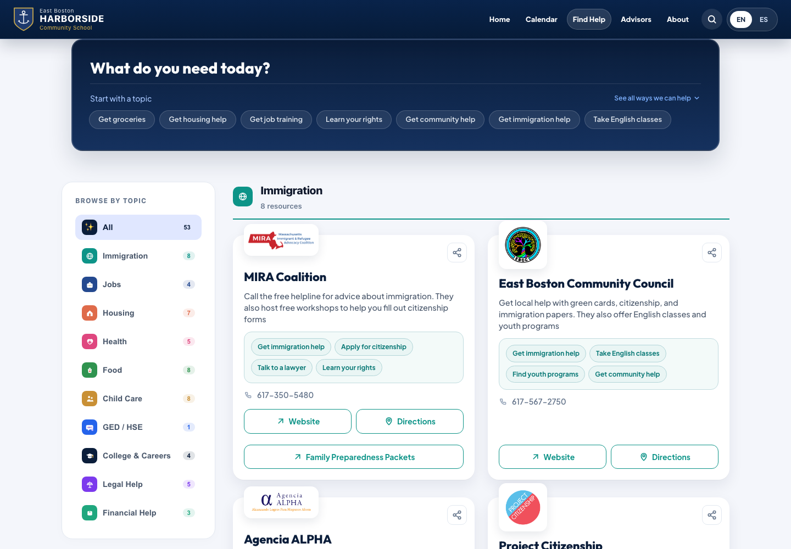

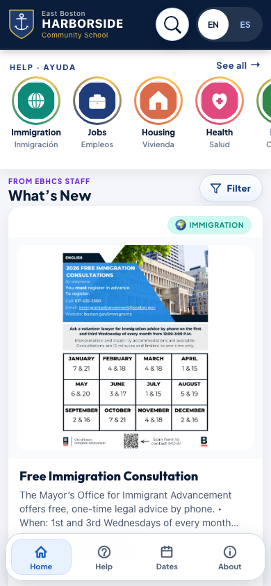

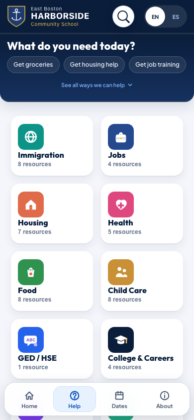

## Quick Start

1. Open the student bulletin board website.
2. Scroll to the bottom and select **Advisor Portal**.
3. Sign in with your @ebhcs.org Google account.
4. Open **Create Post**.
5. Choose the kind of post: **Bulletin**, **Resource**, or **Calendar/Event**.
6. Fill in the main fields, add any details students need, preview the post, then publish.

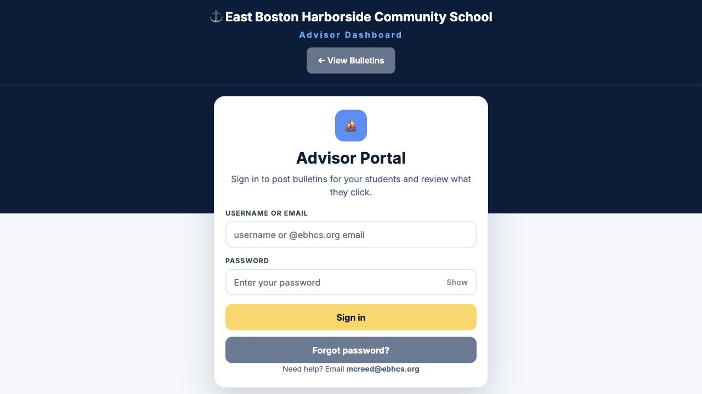
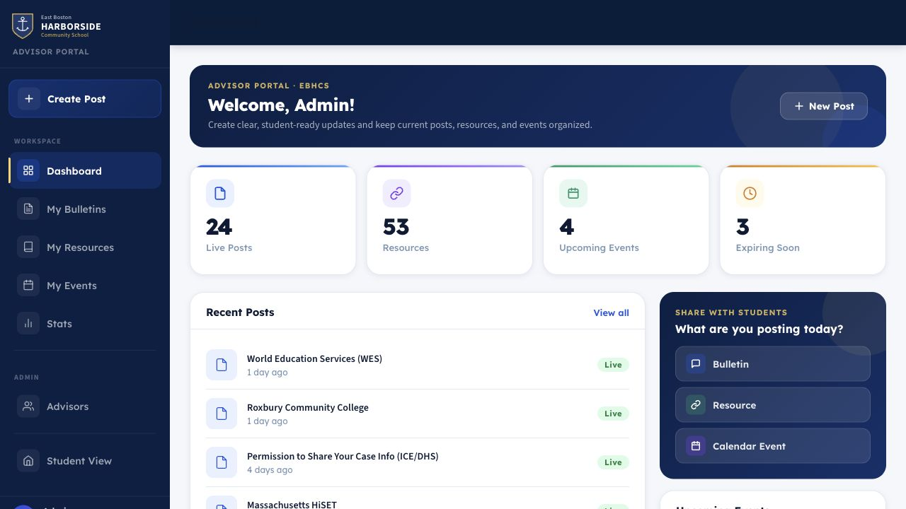

## Login

Click **Sign in with Google** and pick your **@ebhcs.org** school account. There is no password to remember — your school Google login is your portal login.

If sign-in does not work:

- Make sure you picked your **@ebhcs.org** account, not a personal Gmail.
- If you see "isn't on the advisor list", ask an admin to add you on the **Advisors** tab, then sign in again.
- If the sign-in window doesn't appear, allow pop-ups for this site in your browser.
- Still stuck? Email **mcreed@ebhcs.org**.

## Create A Post

Open **Create Post** and pick the post type before filling in details.

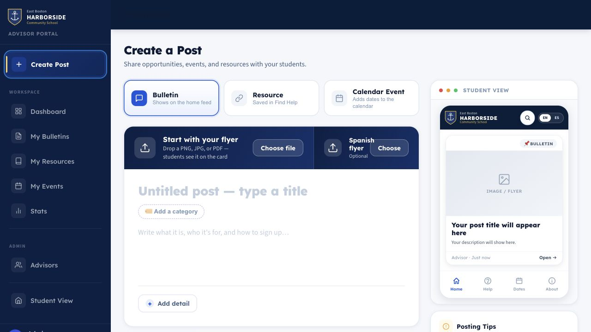

Use the three post types this way:

- **Bulletin**: job help, trainings, announcements, deadlines, and general opportunities.
- **Resource**: Ongoing services, forms, help organizations, and student support links.
- **Calendar/Event**: Events that should appear as dated student opportunities.

Start with the required fields:

- **English title**: Write a clear student-facing title.
- **Category** or **Resource category**: Choose the closest match.
- **Summary/details**: Explain what the student should know and what to do next.

Then use **Add detail** for optional sections:

- **Spanish version**: Add Spanish title and summary. If Spanish text is blank, English is used.
- **Dates & times**: Add a deadline, single event date, date range, or multiple sessions.
- **Sign-up link** or **Website link**: Add the page students should open.
- **Contact & location**: Add organization, address, phone, and call/text preference.
- **Who it's for**: Mark the audience as all students, ESOL, HSE, or FamLit.

## Bulletin Dates And Multiple Sessions

Use **Dates & times** when a bulletin has a deadline, event date, date range, or repeated sessions.

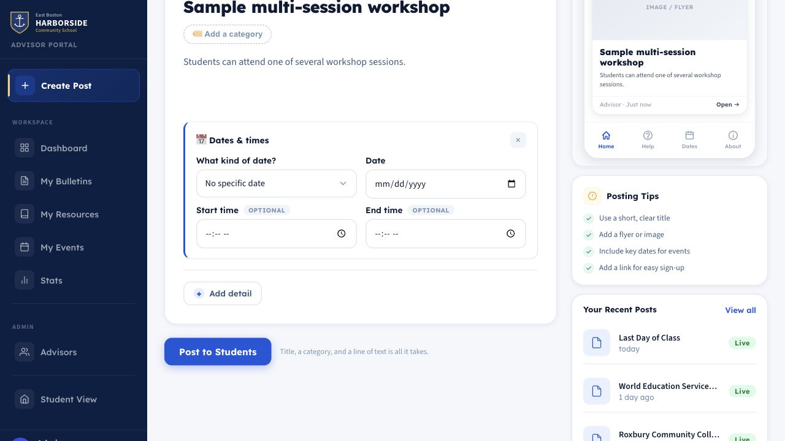

For a bulletin with multiple meeting dates:

1. Select **Add detail**.
2. Choose **Dates & times**.
3. In **What kind of date?**, choose **Multiple sessions**.
4. Add at least two session dates.
5. Add start and end times when they are useful for students.
6. Preview the card before publishing.

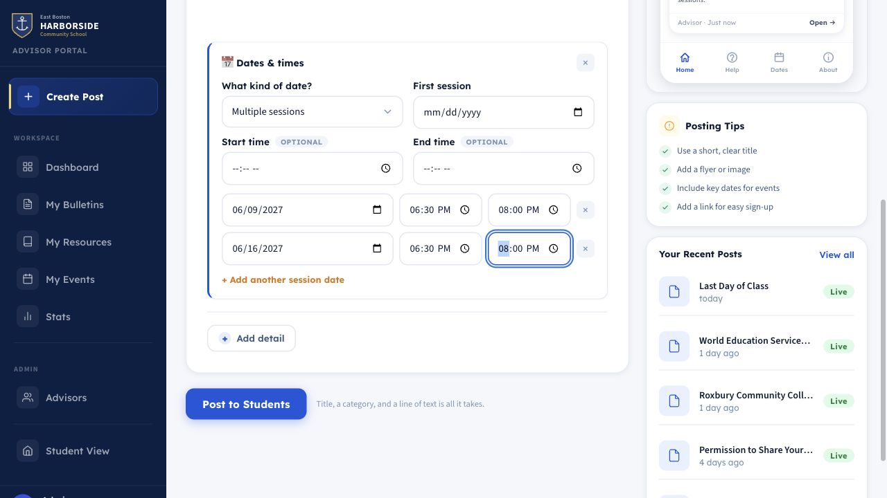

How reposting works for multiple-session bulletins:

- The post is stored as one bulletin with multiple session dates.
- After one session has passed, the system sorts the post back toward the top while another future session remains.
- The post stops getting this sorting boost after the final session has passed.
- This helps students notice repeated events without advisors creating duplicate posts.

## Resource Posts

Choose **Resource** for ongoing help, organizations, forms, service directories, or student support pages.

Resource posts can be one of two kinds:

- **Organization/service**: A resource with a website, phone, address, hours, or service chips.
- **Document/form**: A PDF or official form students can open.

Every resource needs:

- **English title**
- **Resource category**
- Either at least one **student action chip** or a short card summary
- A link for organization/service resources, unless the post already has one while editing

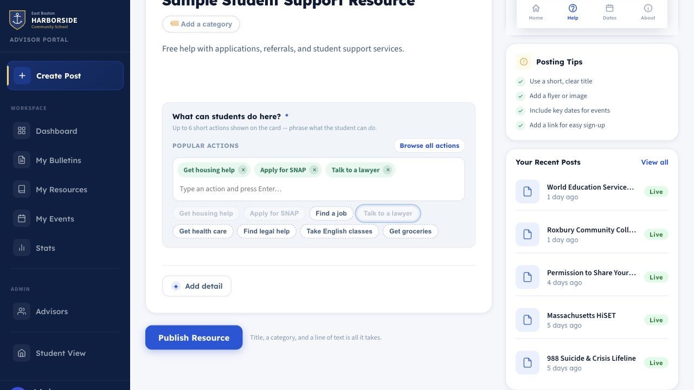

## Student Action Chips

Student action chips are short labels that tell students what a resource helps with, such as **Get housing help**, **Apply for SNAP**, or **Talk to a lawyer**.

Use chips when the resource offers concrete help that students should be able to scan quickly.

How chips work:

- Suggested chips appear based on the resource category.
- Advisors can type a chip and press Enter.
- Advisors can browse/search the chip catalog.
- Up to 6 chips show on the student-facing card.
- Duplicate chips are removed.
- Chips show bilingual labels where translations exist.

Good chip examples:

- **Apply for SNAP**
- **Find a job**
- **Get housing help**
- **Talk to a lawyer**
- **Get health care**
- **Take English classes**

Avoid vague chips like **Helpful**, **Important**, or **More info**. Use the summary field for general explanation.

## Extra Buttons On Resource Cards

Extra buttons add more actions to a resource card. Use them for supporting pages, application steps, eligibility details, forms, flyers, or PDFs.

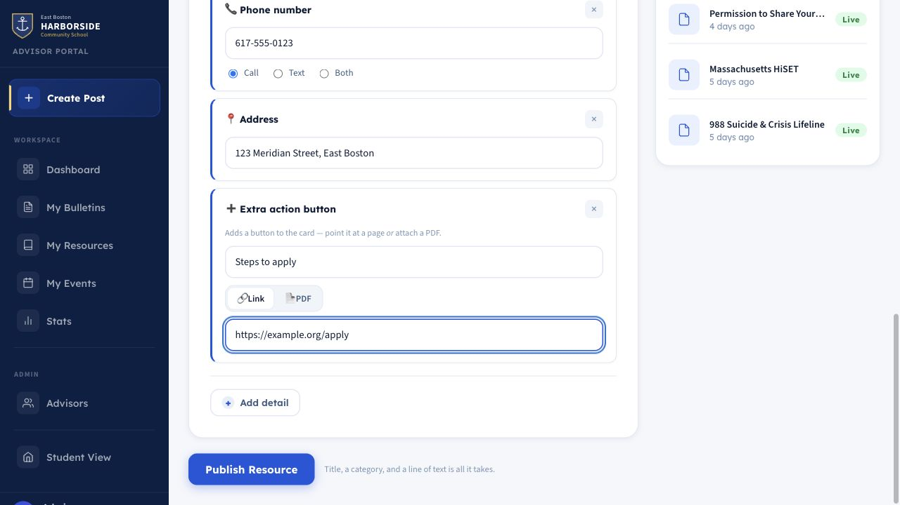
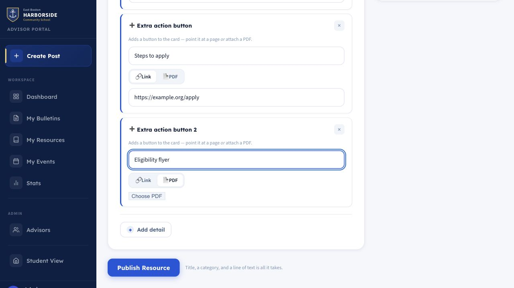

Rules for extra buttons:

- A resource can have up to 5 extra buttons.
- Each button needs an English label.
- Spanish label falls back to English when left blank.
- Each button can point to a URL or a PDF.
- URL buttons open in a new browser tab.
- PDF buttons open the uploaded PDF.

Examples:

- **Steps to apply** -> application instructions page
- **Eligibility rules** -> PDF flyer
- **Class schedule** -> schedule page
- **Referral form** -> PDF form

## What Students See

Student cards show the most useful actions directly on the card.

Depending on the resource details, students may see:

- **Call** when a phone number is provided.
- **Website** when a resource URL is provided.
- **Directions** when an address is provided.
- **Open form** for document/form resources.
- **Official source** when a document resource also has a website.
- Extra action buttons from the resource's extra button blocks.
- Student action chips under the summary.
- A share button on the card.

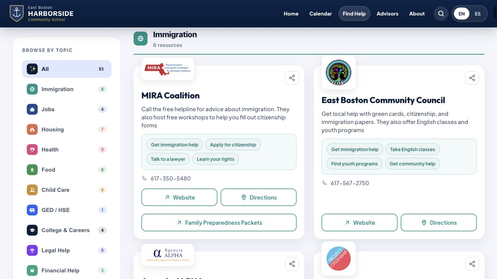

## Preview And Publish

Before publishing:

1. Review the phone preview in the Advisor Portal.
2. Check the title, summary, dates, chips, and buttons.
3. Confirm links and PDFs point to the right place.
4. Publish only when the preview is clear for students.

Posts appear on the student site right away after publishing.

## Manage And Edit Posts

Open the matching management section for the type of post you want to update:

- **My Bulletins** for announcements, jobs, trainings, and general bulletins.
- **My Resources** for Find Help resources and documents.
- **My Events** for calendar events.

Administrators can manage all posts.

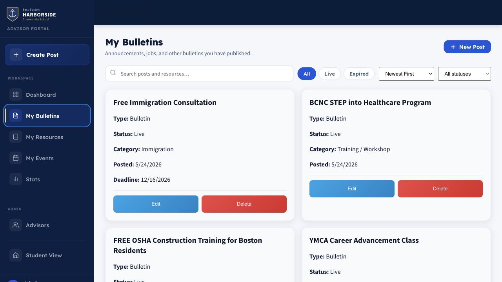

Use **Edit** when:

- Details changed.
- A link or PDF needs to be corrected.
- Session dates or times changed.
- A resource needs more or fewer chips.
- Extra buttons need to be added, removed, or updated.

Use **Delete** when:

- A job is filled.
- An opportunity is no longer available.
- A post should no longer appear to students.

## Best Practices

- Write titles students can understand quickly.
- Put the most important student action in the first sentence.
- Add Spanish text when possible.
- Use dates for deadlines and events.
- Use multiple sessions instead of duplicate posts for repeated events.
- Use resource chips for concrete services, not general descriptions.
- Keep extra buttons specific and action-oriented.
- Preview before publishing.
- Remove or update old posts regularly.

## Quick Reference

| Task | Where to go |
| --- | --- |
| Log in | Student site footer -> **Advisor Portal** |
| Create a bulletin | **Create Post** -> **Bulletin** |
| Create a resource | **Create Post** -> **Resource** |
| Add repeated event dates | **Add detail** -> **Dates & times** -> **Multiple sessions** |
| Add student action chips | Resource composer chip field |
| Add extra URL/PDF buttons | Resource composer -> **Add detail** -> **Extra button** |
| Preview | Phone preview in Advisor Portal |
| Edit or delete | **My Bulletins**, **My Resources**, or **My Events** |
